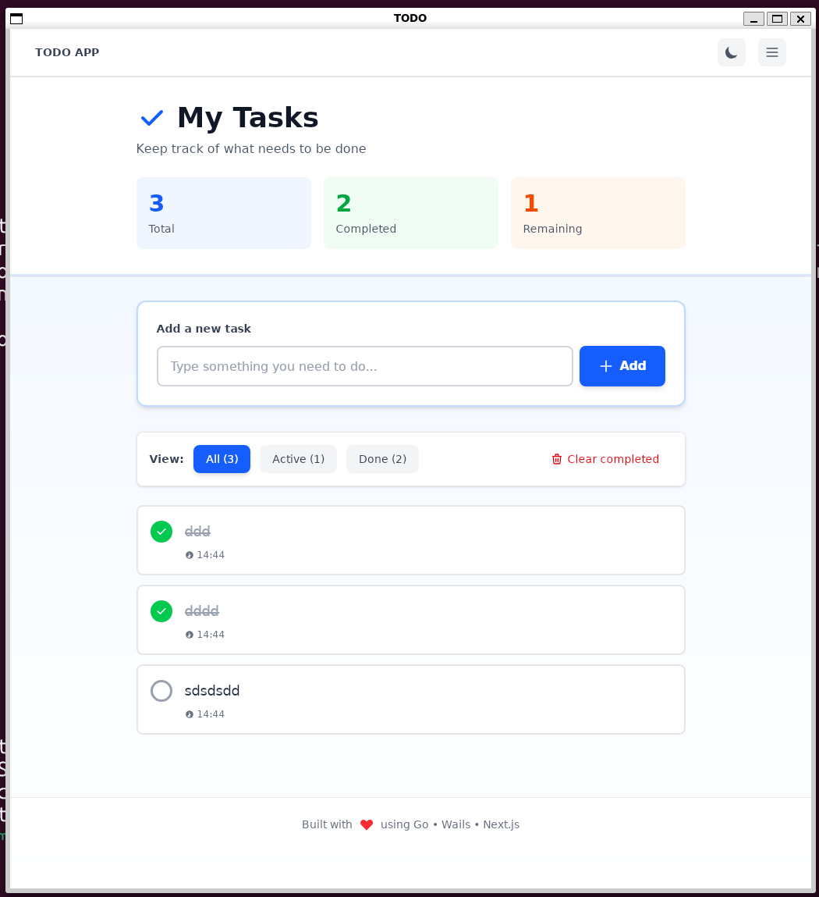
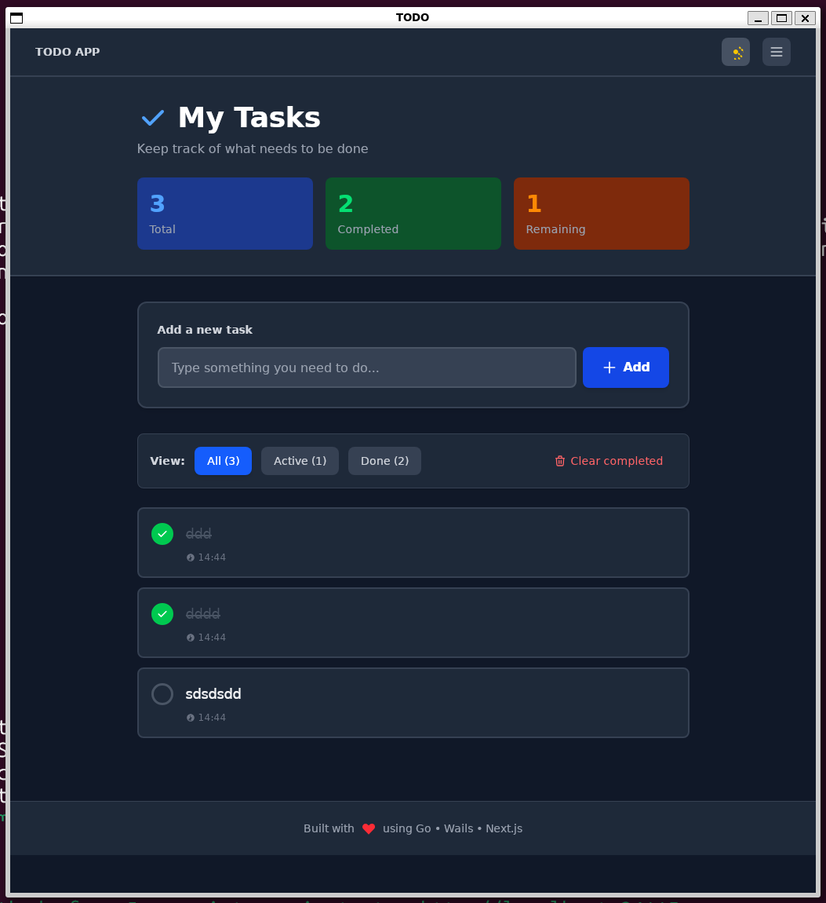

# 📝 Todo App - Wails

A beautiful, modern todo application built with **Go**, **Wails**, **React**, **TypeScript**, and **SQLite**. Features persistent storage, dark mode, SVG icons, and a professional user interface.


## ✨ Features

- **📊 Task Management** - Create, read, update, delete todos with persistence
- **💾 SQLite Database** - All tasks stored locally in a SQLite database
- **🌓 Dark Mode** - Toggle between light and dark themes
- **📥 Export Tasks** - Export all todos as formatted JSON files to Downloads
- **🎯 Smart Filtering** - Filter tasks by All, Active, or Completed status
- **🎨 Beautiful UI** - Clean, modern interface with SVG icons and smooth animations
- **⚡ Real-time Updates** - Instant UI updates with responsive design
- **📱 Responsive Layout** - Works great on different window sizes
- **⌨️ Keyboard Support** - Press Enter to add tasks quickly
- **🎯 Task Stats** - View total, completed, and remaining tasks at a glance

## 📸 Screenshots

### Main Interface


### Dark Mode & Features


## 🛠️ Tech Stack

### Backend
- **Go 1.24** - Server-side logic and API
- **Wails v2.11.0** - Desktop application framework
- **SQLite3** - Persistent data storage

### Frontend
- **React 19.2** - UI framework
- **TypeScript** - Type-safe JavaScript
- **Next.js 16.1** - React framework with SSR
- **Tailwind CSS v4** - Utility-first styling

## 🚀 Getting Started

### Prerequisites
- Go 1.24 or higher
- Node.js 16+ and npm
- Wails CLI v2.11.0

### Installation

1. **Clone the repository**
```bash
git clone https://github.com/imcanugur/wails-demo-todo.git
cd wails-demo-todo
```

2. **Install dependencies**
```bash
wails build
```

The command will install all Go and Node.js dependencies automatically.

## 💻 Development

### Run in Development Mode
```bash
wails dev
```

This starts both the Wails backend and Next.js frontend with hot reload enabled.

Access the app:
- **Desktop App**: Runs in a native window
- **Browser Dev**: http://localhost:34115 (Go method access)
- **Frontend Dev**: http://localhost:3000 (Next.js dev server)

### Project Structure
```
wails-demo-todo/
├── app.go                  # Go backend with CRUD operations
├── main.go                 # Wails entry point
├── go.mod                  # Go dependencies
├── wails.json              # Wails configuration
└── frontend/
    ├── app/
    │   ├── page.tsx        # Main React component
    │   ├── layout.tsx      # Root layout
    │   └── globals.css     # Global styles & Tailwind
    ├── package.json        # Node.js dependencies
    └── next.config.ts      # Next.js configuration
```

## 📖 Usage

### Adding Tasks
1. Type your task in the input field
2. Press Enter or click the **+** button
3. Task is instantly saved to the database

### Managing Tasks
- **Toggle Complete**: Click the circle checkbox to mark tasks as done
- **Delete Task**: Hover over a task and click the trash icon
- **Filter Tasks**: Use the View tabs to filter by status

### Exporting Tasks
1. Click the **menu button** (☰) in the top-right
2. Select **Export Tasks**
3. Task file is saved to your **Downloads** folder as `todos-TIMESTAMP.json`

### Dark Mode
Toggle dark mode using the sun/moon icon in the top menu bar.

## 🏗️ Building for Distribution

Create a production-ready binary:

```bash
wails build
```

Output binaries:
- **Linux**: `build/bin/wails-demo-linux-amd64`
- **Windows**: `build/bin/wails-demo-windows-amd64.exe`
- **macOS**: `build/bin/wails-demo-darwin-universal`

## 📊 API Methods (Go Backend)

All Go methods are automatically exposed to the frontend via Wails bindings:

| Method | Description |
|--------|-------------|
| `GetTodos()` | Fetch all todos from database |
| `AddTodo(text, priority)` | Create a new todo |
| `ToggleTodo(id)` | Mark a todo as complete/incomplete |
| `DeleteTodo(id)` | Delete a specific todo |
| `ClearCompleted()` | Delete all completed todos |
| `ExportTodos()` | Export all todos as JSON |

## 🎨 Customization

### Change Theme Colors
Edit `frontend/app/globals.css` and modify the `@theme` section:

```css
@theme {
  --color-primary: #3b82f6;     /* Blue */
  --color-success: #10b981;     /* Green */
  --color-danger: #ef4444;      /* Red */
  /* ... more colors ... */
}
```

### Modify UI
React component is in `frontend/app/page.tsx`. Uses **Tailwind CSS** utility classes.

## 📝 License

This project is licensed under the **MIT License** - see [LICENSE](LICENSE) file for details.

## 👤 Author

**imcanugur**

## 🙏 Acknowledgments

- [Wails](https://wails.io) - Desktop app framework
- [Tailwind CSS](https://tailwindcss.com) - Styling
- [React](https://react.dev) - UI library
- [Heroicons](https://heroicons.com) - SVG icons (we used similar patterns)

## 📞 Support

For issues and questions:
- Open an issue on GitHub
- Check the [Wails Documentation](https://wails.io/docs)
- Review the [React Documentation](https://react.dev)

---

**Made with ❤️ using Go, Wails & React**
